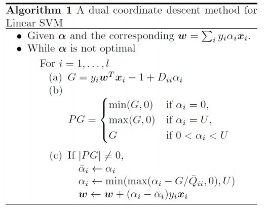
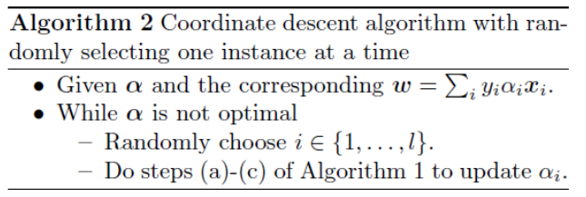
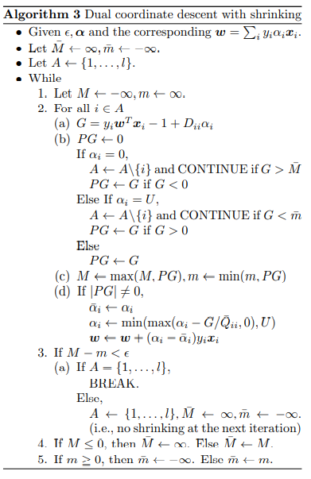

# Dual_Coordinate_Descent_for_Large-scale_Linear_SVM

Collaborators: [Dumitrache Larisa](https://github.com/DLarisa),
               [Stegarescu Ana-Maria](https://github.com/StegarescuAnaMaria)
               
We implemented 3 algorithms described in the original paper, in order to determine which gives better results. These algorithms are meant to divide large amounts of data by their classes.

The [dataset](https://www.csie.ntu.edu.tw/~cjlin/libsvmtools/datasets/binary.html#a9a) consists of separate arrays of numbers on each line, representing different n-dimensional points of the cardinal system. The first number represents the class of the point, "-1" or "+1", accompanied by the scaled coordinates (in proportion to 1). The goal of the algorithms is determining the correct weight, so that w*x <= y if y = -1 and    w*x >= y if y = 1, where x is the cardinal point, w is the weight and y is the class, and the distance between the closest to each other 2 points of opposite classes is maximum.

(the bias (b) from the above graphs will not be taken into consideration)

The first two algoritms are very similar, but the 2nd converges faster:

The first algorithm continues to change the value of the weights until w*x >= y or w*x <= y is met for all x. The 2nd algorithm optimizes only the values that need to be optimized.

The 3rd algorithm seems to take more steps than the other two:

