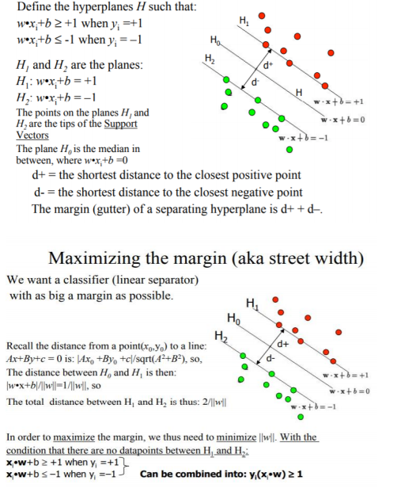

# Dual_Coordinate_Descent_for_Large-scale_Linear_SVM

Collaborators: [Dumitrache Larisa](https://github.com/DLarisa),
               [Stegarescu Ana-Maria](https://github.com/StegarescuAnaMaria)
We implemented 3 algorithms described in the original paper, in order to determine which gives better results. These algorithms are meant to divide large amounts of data by their classes.

The dataset consists of separate arrays of numbers on each line, representing different n-dimensional points of the cardinal system. The first number represents the class of the point, "-1" or "+1", accompanied by the scaled coordinates (in proportion to 1). The goal of the algorithms is determining the correct weight, so that w*x <= y if y = -1 and    w*x >= y if y = 1, where x is the cardinal point, w is the weight and y is the class, and the distance between the nearest 2 points of opposite classes is maximum.

